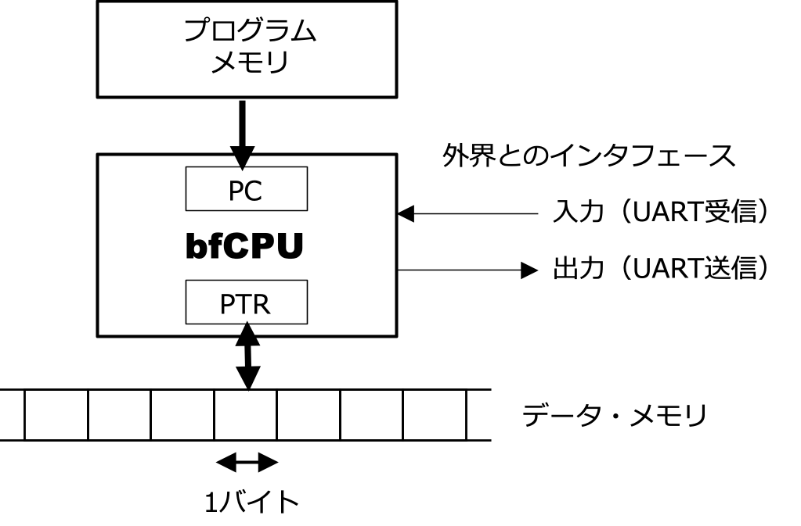
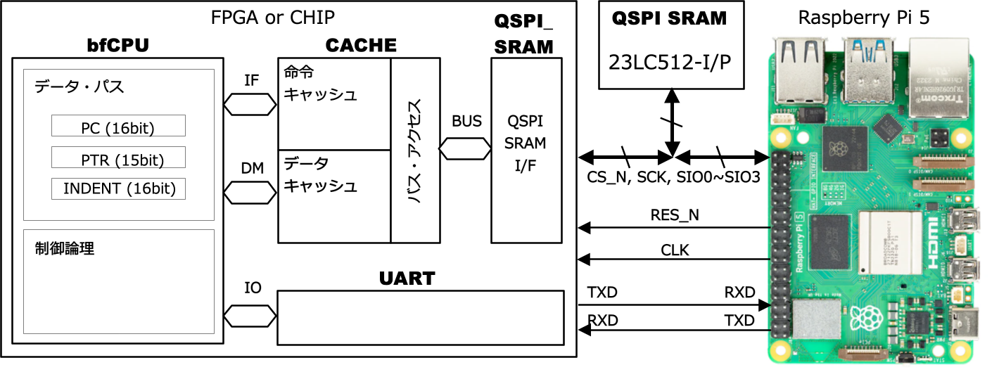

# bfCPU, a Turing-complete machine
The objective of this project is to design a **Turing-complete machine** for Tiny Tapeout. 

## Building the Turing-Complete bfCPU

One of the most famous examples of a simple, yet fully Turing-complete machine is the architecture proposed in 1993 by Urban Müller of Switzerland, known as Brainf*ck (where * is 'u') [[Wiki bfCPU]](https://en.wikipedia.org/wiki/Brainfuck). I have obscured one letter due to the somewhat indelicate nature of the name; in this project, I will refer to this CPU architecture as "bfCPU." The bfCPU is an 8-bit CPU with only eight commands. Remarkably, these few commands are sufficient to implement any arbitrary algorithm. We will actually design this CPU, implement it on an FPGA, and ultimately enjoy the process of turning it into silicon via Tiny Tapeout.

## The bfCPU Architecture

### The Profundity of bfCPU
Programs written for bfCPU have extremely low readability and writability, earning it a spot among "esoteric programming languages" (esolangs). Even performing a simple addition feels like solving a complex puzzle. When we write a program for bfCPU, we find ourselves inadvertently and mischievously grinning. Indeed, I found myself grinning as well when I first encountered bfCPU.

### Basic Architecture of bfCPU
The basic architecture of the bfCPU is shown in below.



The internal resources of the bfCPU consist solely of a Program Counter (PC) and a Data Memory Pointer (PTR). The PC indicates the address of the instruction stored in the program memory. The CPU fetches the instruction from the program memory at the address pointed to by the PC, and according to that instruction, it either manipulates the Data Memory Pointer (PTR) or accesses the data at the address in the data memory pointed to by the PTR. Each address in the data memory stores 8-bit (byte-sized) data.

Furthermore, there is an I/O mechanism for interfacing with the outside world. In the bfCPU designed for this project, external input is handled as received data via a UART (Universal Asynchronous Receiver/Transmitter), and external output is handled as transmitted data from the UART. The structure of the bfCPU is as simple as that.

### bfCPU Instruction Set
The list of the bfCPU instruction set is shown in Table 1 below. The bfCPU originally features only eight instructions with opcodes (binary) from `0000` to `0111`. While 3 bits would suffice for eight instructions, the bfCPU designed here includes two additional instructions (`reset` and `nop`), resulting in a 4-bit instruction code length. All of these instruction codes consist only of an opcode indicating the operation; they have a simple structure with no operands to specify targets.

The original instruction notation for bfCPU consists of single characters shown in the "Symbol" column of the table below (`<`, `>`, `+`, `-`, etc.). A program is formed by lining up these characters without gaps, or with occasional spaces and line breaks, which is why it is called an esoteric language. As described later, I have developed an assembler and instruction simulator called **bfTool** for bfCPU program development. This assembler accepts the original single-character bfCPU instructions, allowing the use of the vast number of publicly available bfCPU programs. However, it also supports the "Mnemonic" descriptions to improve readability. The "C-Equivalent" column represents the operation of each instruction in the C language. Note that while the original bfCPU uses ASCII characters directly as the program, the bfCPU designed in this article replaces each instruction with a 4-bit instruction code.

**Table 1: bfCPU Instruction Set**
| Instruction Code (Hex) | Mnemonic | Symbol | C-Equivalent | Description |
| :--- | :--- | :---: | :--- | :--- |
| 0x0 | INC_PTR | `>` | `++ptr;` | Increment the data pointer. |
| 0x1 | DEC_PTR | `<` | `--ptr;` | Decrement the data pointer. |
| 0x2 | INC_DATA | `+` | `++*ptr;` | Increment the byte at the data pointer. |
| 0x3 | DEC_DATA | `-` | `--*ptr;` | Decrement the byte at the data pointer. |
| 0x4 | OUTPUT | `.` | `putchar(*ptr);` | Output the byte at the data pointer. |
| 0x5 | INPUT | `,` | `*ptr = getchar();` | Input a byte and store it at the data pointer. |
| 0x6 | JMP_FWD | `[` | `while (*ptr) {` | Jump forward past `]` if the byte at the pointer is 0. |
| 0x7 | JMP_BACK | `]` | `}` | Jump back to the command after `[` if the byte at the pointer is non-zero. |
| 0x8 | NOP | - | - | No operation. |
| 0xF | RESET | - | - | Reset the CPU state. |

### How do the `begin` ([) and `end` (]) Instructions Handle Jumping?
In a typical CPU, an instruction code consists of an "opcode," which indicates what the instruction does, and "operands," which specify the target of the operation—such as a memory address for data transfer, a constant value for addition, or the target address for a branch instruction. However, the 4-bit instruction code of the bfCPU contains only the opcode. Since the bfCPU only operates on the Data Pointer (PTR) and data memory, opcodes alone might seem sufficient. However, the lack of operands to define the branch targets for the `begin` ([) and `end` (]) instructions poses a challenge.

If we were to increase the bit length of the bfCPU instruction codes to include branch target information, an assembler or compiler could determine the corresponding addresses of nested `begin` and `end` pairs when generating machine code. However, for the sake of simplicity in this project, we have opted to keep all instruction codes within 4 bits. Consequently, the branch instructions (begin and end) do not contain any destination information.

So, how do the `begin` and `end` instructions find their branch targets? The answer lies in **searching the program memory**.

When a `begin` ([) instruction triggers a jump to the instruction following the corresponding `end` (]), the execution logic clears an internal register called `INDENT` to zero and then searches through the program memory by incrementing the PC. If another `begin` ([) is encountered, the CPU assumes the nesting has deepened and increments `INDENT`. If an `end` (]) is found while `INDENT` is greater than zero, it means this `end` does not correspond to the initial `begin`, so the CPU decrements `INDENT` and continues the search. Finally, when an `end` (]) is found while `INDENT` is zero, the CPU identifies it as the matching pair and resumes execution from the following instruction.

Conversely, when an `end` (]) instruction triggers a jump back to the instruction following the corresponding `begin` ([), the execution logic clears the `INDENT` register and searches the program memory by decrementing the PC. If another `end` (]) is encountered, it increments `INDENT`. If a `begin` ([) is found while `INDENT` is greater than zero, it decrements `INDENT` and continues searching. When a `begin` ([) is finally found while `INDENT` is zero, it is identified as the matching pair, and execution resumes from the instruction immediately following that `begin`.

As described, since the `begin` and `end` instructions cannot jump to their destinations in a single cycle, searching through program memory stored in a relatively slow QSPI SRAM is a performance disadvantage. However, as will be discussed later, by equipping the CPU with an **instruction cache**, we minimize the need to access the external QSPI SRAM during these searches, thereby keeping performance degradation to a minimum.

### Important Notes on bfCPU Programs
The `begin` ([) and `end` (]) instructions can be nested to any depth, but they must always be correctly paired. Additionally, while the data width of each cell in the data memory is 8 bits (one byte), the values wrap around: adding 1 to `0xFF` results in `0x00`, and subtracting 1 from `0x00` results in `0xFF`. There are no flags to indicate the occurrence of a carry, borrow, or overflow.

## bfCPU Assembler and Simulator: **bfTool**

I have developed **bfTool**, a development utility for creating bfCPU programs and simulating instruction behavior on a PC. It is located in the `bfCPU/bfTool` directory within the repository.

### How to Build bfTool

The source code is stored in the `src` directory. Since it is written in standard C, you can compile it with `gcc`. In addition to `gcc`, you will also need `flex` and `bison`. You can build `bfTool` using the following command:

```bash
sudo apt install flex bison
cd bfCPU/bfTool
make
```
### Related Files for bfTool
Some of the programs mentioned previously are included as sample programs in the `bfTool/samples` directory. The file extensions are defined as follows. In the assembly source files (.asm), you can write comments using double slashes (//), similar to C.

- .asm: Assembly source file
- .lis: Assembly list file
- .hex: Assembly object file (Intel HEX format)
- .v: Assembly object file (Verilog memory initialization format)
- .sim: Simulation log file

### How to Assemble a Program
To assemble a source program, enter the following commands:
``` bash
cd bfTool/samples
bfTool filename.asm
```

This will generate `filename.lis`, `filename.hex`, and `filename.v`.
`filename.lis` displays the assembly results, mapping the address of each instruction to its corresponding code. Furthermore, single-character instructions are displayed as indented mnemonic instructions.
`filename.hex` is the object code generated by the assembler. It follows the Intel HEX format, where data is arranged in bytes. Since bfCPU instruction codes are 4 bits wide, the code for the lower address is stored in the lower 4 bits of the byte, and the code for the higher address is stored in the upper 4 bits (little-endian). This `filename.hex` file is used as input when simulating instruction behavior with bfTool.
`filename.v` is also an object code file generated by the assembler. This file is used to initialize the program memory when performing functional verification of the bfCPU system (written in SystemVerilog) through logic simulation.

### How to Simulate a Program
To simulate a program, run the command with the -s option followed by the `filename.hex` file.
```bash
cd bfTool/samples
bfTool -s filename.hex
```
When the simulator encounters a "reset instruction", the following message will be displayed. Pressing the Enter key will restart execution from address 0x00.
```text
Hit Enter to Reset
```
If you press `CTRL-C` during simulation, the process will be interrupted, and the simulator will display the instruction immediately preceding the interruption along with the maximum data memory consumption (the maximum value reached by the PTR).
```text
PC=0x00 ROM[0x00]=0x5 (IN   ) Input 8bit Hex Number? ^C
Aborted: MAXPTR=0x0001(1)
```
During simulation, you can specify the behavior of the "in" and "out" instructions as follows:

#### Inputting/Outputting Binary Values with "in" and "out"
To handle input and output as binary values, execute the command with only the -s option.
```bash
bfTool -s filename.hex
```
As shown below, when an "in" instruction is executed, the simulator waits for a byte value (hexadecimal without the "0x" prefix). When an "out" instruction is executed, it displays the byte value (hexadecimal with "0x" and the decimal equivalent in parentheses).
```text
PC=0x00 ROM[0x00]=0x5 (IN   ) Input 8bit Hex Number? 4
PC=0x02 ROM[0x02]=0x5 (IN   ) Input 8bit Hex Number? 5
PC=0x0b ROM[0x0b]=0x4 (OUT  ) --> PTR=0x01 RAM[0x01]=0x09 OUTPUT=0x09(  9)(	)
```

#### Inputting/Outputting ASCII Strings with "in" and "out"
To handle input and output as ASCII strings, execute the command with the -t option added.
```bash
bfTool -st filename.hex
```
As shown below, the simulator will wait for ASCII character input when an "in" instruction is reached, and will output ASCII characters when an "out" instruction is reached.
```text
Hello World!   ← ASCII Output
Hit Enter Key
```
```text
123   ← ASCII Input + \n
123   ← ASCII Output
Hit Enter Key
```
#### Generating Instruction Execution Log Files
By adding the -g option during simulation, you can output an instruction execution log to a file named filelist.sim. Adding the -b option outputs the execution log to stdout. You can combine the -g, -b, and -t options as needed.
```bash
$ bfTool -sg filename.hex
$ bfTool -sb filename.hex
$ bfTool -sgb filename.hex
$ bfTool -sgbt filename.hex
```
Example Log Output:
```
00000 : PC=0x00 ROM[0x00]=0x5 (IN   ) --> PTR=0x00 RAM[0x00]=0x03 INPUT=0x03(  3)(^C)
00001 : PC=0x01 ROM[0x01]=0x0 (P++  ) --> PTR=0x01 RAM[0x01]=0x00(  0)
00002 : PC=0x02 ROM[0x02]=0x5 (IN   ) --> PTR=0x01 RAM[0x01]=0x04 INPUT=0x04(  4)(^D)
00003 : PC=0x03 ROM[0x03]=0x1 (P--  ) --> PTR=0x00 RAM[0x00]=0x03(  3)
00004 : PC=0x04 ROM[0x04]=0x6 (BEGIN) --> PTR=0x00 RAM[0x00]=0x03(  3)
00005 : PC=0x05 ROM[0x05]=0x3 (DEC  ) --> PTR=0x00 RAM[0x00]=0x02(  2)
00006 : PC=0x06 ROM[0x06]=0x0 (P++  ) --> PTR=0x01 RAM[0x01]=0x04(  4)
00007 : PC=0x07 ROM[0x07]=0x2 (INC  ) --> PTR=0x01 RAM[0x01]=0x05(  5)
00008 : PC=0x08 ROM[0x08]=0x1 (P--  ) --> PTR=0x00 RAM[0x00]=0x02(  2)
00009 : PC=0x09 ROM[0x09]=0x7 (END  ) --> PTR=0x00 RAM[0x00]=0x02(  2)
00010 : PC=0x05 ROM[0x05]=0x3 (DEC  ) --> PTR=0x00 RAM[0x00]=0x01(  1)
00011 : PC=0x06 ROM[0x06]=0x0 (P++  ) --> PTR=0x01 RAM[0x01]=0x05(  5)
00012 : PC=0x07 ROM[0x07]=0x2 (INC  ) --> PTR=0x01 RAM[0x01]=0x06(  6)
00013 : PC=0x08 ROM[0x08]=0x1 (P--  ) --> PTR=0x00 RAM[0x00]=0x01(  1)
00014 : PC=0x09 ROM[0x09]=0x7 (END  ) --> PTR=0x00 RAM[0x00]=0x01(  1)
00015 : PC=0x05 ROM[0x05]=0x3 (DEC  ) --> PTR=0x00 RAM[0x00]=0x00(  0)
00016 : PC=0x06 ROM[0x06]=0x0 (P++  ) --> PTR=0x01 RAM[0x01]=0x06(  6)
00017 : PC=0x07 ROM[0x07]=0x2 (INC  ) --> PTR=0x01 RAM[0x01]=0x07(  7)
00018 : PC=0x08 ROM[0x08]=0x1 (P--  ) --> PTR=0x00 RAM[0x00]=0x00(  0)
00019 : PC=0x09 ROM[0x09]=0x7 (END  ) --> PTR=0x00 RAM[0x00]=0x00(  0)
00020 : PC=0x0a ROM[0x0a]=0x0 (P++  ) --> PTR=0x01 RAM[0x01]=0x07(  7)
00021 : PC=0x0b ROM[0x0b]=0x4 (OUT  ) --> PTR=0x01 RAM[0x01]=0x07 OUTPUT=0x07(  7)(^G)
00022 : PC=0x0c ROM[0x0c]=0x8 (RESET) --> PTR=0x01 RAM[0x01]=0x07(  7)
```

## bfCPU Program Examples
###Addition Program
An example of an addition program is shown in the following listing. The file is located at `bfCPU/bfTool/samples/addition.asm` in the repository. Let the contents of the data memory starting from address PTR=0 be {c0, c1}. The program receives the augend and addend as byte data (binary values) from the UART using the in instruction and stores them in c0 and c1, respectively. Then, within a begin-end loop, it decrements the value in c0 while simultaneously incrementing the value in c1. Once the value in c0 reaches zero, the value in c1 represents the sum. Finally, it transmits the contents of address c1 (the binary value) via the UART.
```asm
in    // ptr=0
p++   // increment ptr
in    // ptr=1
p--   // decrement ptr
begin // Loop
  dec // ptr=0
  p++ // increment ptr
  inc // ptr=1
  p-- // decrement ptr
end
p++   // increment ptr
out   // ptr=1

reset // restart
```

### Hello World! Program
This is the quintessential first program for any programming language. An example is shown in the listing below. The file is located at bfCPU/bfTool/samples/helloworld.asm. When executed, it sends the ASCII string "Hello World!\n" via the UART. The final newline code is 0x0A.
```asm
++++++++[>++++[>++>+++>+++>+<<<<-]>+>+>->>+[<]<-]>>.>---.+++++++..+++.>>.<-.<.+++.------.--------.>>+.>++.
//
reset // restart
```

### Other Programs
Other sample programs are stored in the `bfCPU/bfTool/samples` directory of the repository:
- multiplication.asm: Multiplication
- inputdec.asm: Receives a decimal ASCII string via UART and converts it to a binary value.
- printdec.asm: Converts a binary value to a decimal ASCII string and transmits it via UART.
- tictactoe.asm: Tic-Tac-Toe game.
- life.asm: Conway's Game of Life.
I believe each of these programs is a high-effort masterpiece. Many other programs for the bfCPU (Brainfuck) architecture are also available online: [[esolangs]](https://esolangs.org/wiki/Brainfuck).

The bfCPU is recognized as a Turing-complete machine, meaning it is capable of performing any computational task possible for a computer. However, programs tend to become highly cryptic, and execution times can be quite long. Nevertheless, the process of solving these "puzzles" is profound and offers the ultimate form of intellectual entertainment.

## Logical Design of the bfCPU System
Let’s proceed with the actual design of the computer system based on the bfCPU architecture described above.

### Overall System Configuration
The overall configuration of the bfCPU system is shown in the block diagram below. The interior of the chip or FPGA (bfCPU chip) incorporates the bfCPU core, cache memory, a QSPI SRAM interface, and a UART. For external memory, a single 512Kbit (64Kbyte) QSPI SRAM 23LC512 (Microchip) is connected.



### bfCPU Memory Map and Memory Configuration
The memory map showing how the bfCPU chip allocates the external QSPI SRAM is illustrated in the following image. The bfCPU has two distinct memory spaces.

- Instruction Space: Has a size of 4 bits wide × 65,536 words. It is accessed by the bfCPU's program counter (PC) using addresses 0x0000 to 0xFFFF.
- Data Space: Has a size of 8 bits wide × 32,768 words. It is accessed by the bfCPU's data pointer (PTR) using addresses 0x0000 to 0x7FFF.

Within the bfCPU chip, the IF (Instruction Fetch) bus accesses the instruction cache, while the DM (Data Memory) bus accesses the data cache. If a miss occurs in either the instruction or data cache, the external QSPI SRAM is accessed. If both caches attempt to access the QSPI SRAM simultaneously, priority is given to the data cache access, and the instruction cache access is made to wait. If instruction cache access were prioritized, instructions that cannot complete execution would accumulate within the bfCPU, leading to a system hang.

When a cache miss occurs, the QSPI SRAM is accessed via the BUS bus. Within the 64Kbytes of the QSPI SRAM chip, the first 32Kbytes (addresses 0x0000 to 0x7FFF) are assigned to the instruction space, and the latter 32Kbytes (addresses 0x8000 to 0xFFFF) are assigned to the data space.

### How to Write to QSPI SRAM
A Raspberry Pi 5 board (Raspi) is used to write programs into the QSPI SRAM instruction memory. The Raspi supplies the clock and reset signals to the bfCPU chip. While the Raspi is holding the bfCPU chip in a reset state, the bfCPU chip sets its QSPI SRAM interface signals to a high-impedance (Hi-Z) state. During this time, the Raspi writes the program to the QSPI SRAM via GPIO operations. Afterward, the Raspi sets its own QSPI SRAM interface signals to Hi-Z and releases the reset, allowing the bfCPU chip to begin executing the program stored in the QSPI SRAM.

### Input/Output via UART
The bfCPU chip is equipped with a UART for input and output. The UART transmission and reception signals are connected directly to the Raspberry Pi, allowing strings and binary data to be handled through terminal software on the Raspi.
The UART baud rate is not fixed, as it depends on the operating frequency of the bfCPU. While the Raspi is resetting the bfCPU chip, it writes the UART baud rate configuration value to the final address of the QSPI SRAM. Immediately after the reset is released, the bfCPU chip reads that address to configure the UART baud rate. Typically, the baud rate is set to 115,200 bps, and communication uses an 8-bit, no parity, 1-stop bit (8N1) format.


